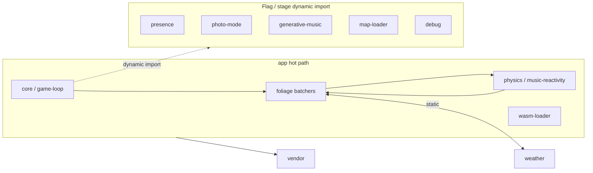

# App Chunk Split (#1361 / #1450 / #1495)

## Problem

Production builds emitted a single `chunks/app-*.js` that bundled core, foliage,
systems, world, and UI into one Rollup chunk to avoid circular _chunk_ graphs.
First paint downloaded the full game brain even when optional features (presence,
photo mode, generative audio, debug overlays) were off.

Vite warns when any chunk exceeds 500 KB raw. The `app` chunk can sit near that
soft limit because foliage batchers + music-reactivity + physics stay co-located.

## Targets

| Metric                  | Hard ceiling                               | Stretch | Notes                                                                                     |
| ----------------------- | ------------------------------------------ | ------- | ----------------------------------------------------------------------------------------- |
| `app` raw (`build:ci`)  | **620 KB**                                 | 500 KB  | 600 KB peels (`world-gen`, `loading-ui` DOM, `discovery-persistence`→save-ui) TDZ at boot |
| Vite warning            | 500 KB                                     | —       | Informational until a cycle-safe foliage peel                                             |
| Critical-path flags off | presence / photo / generative not in `app` | —       | Verify: `rg createClient dist/chunks/app-*.js` should miss                                |

Confirm flags-off: `pnpm run analyze:bundle` or grep `dist/chunks/app-*.js` for
`createClient` / `GenerativeEngine` / `initPhotoMode`.

## Baseline (pre-#1495 peel, ~778–808 KB `app`)

| Chunk    | Raw         | Gzip    |
| -------- | ----------- | ------- |
| `app`    | ~778–808 KB | ~239 KB |
| `vendor` | ~1069 KB    | ~282 KB |

## After this peel (`build:ci`)

| Chunk              | Raw (approx.) | Gzip    | Critical path when                                    |
| ------------------ | ------------- | ------- | ----------------------------------------------------- |
| `app`              | **~617 KB**   | ~195 KB | Always (foliage + physics + music-reactivity + audio) |
| `vendor`           | ~955 KB       | ~260 KB | Always                                                |
| `weather`          | ~111 KB       | ~31 KB  | Boot (orchestrator + particles + compute + berries)   |
| `save-ui`          | ~64 KB        | ~16 KB  | `openSaveMenu`                                        |
| `accessibility-ui` | ~37 KB        | ~10 KB  | Accessibility menu                                    |
| `analytics-debug`  | ~36 KB        | ~9 KB   | `?debug=1` / `/stats`                                 |
| `debug`            | ~30 KB        | ~10 KB  | `?debug=*`                                            |
| `presence`         | ~20 KB        | ~7 KB   | `FEATURE_FLAGS.presence`                              |
| `gameplay`         | ~16 KB        | ~5 KB   | After `__sceneReady` / first ability                  |
| `map-loader`       | ~16 KB        | ~5 KB   | Enter / map fetch                                     |
| `world-content`    | ~14 KB        | ~5 KB   | Procedural extras                                     |
| `profiler`         | ~14 KB        | ~5 KB   | Boot (circular with `app`)                            |
| `photo-mode`       | ~13 KB        | ~4 KB   | `FEATURE_FLAGS.photoMode` or **P**                    |
| `generative-music` | ~11 KB        | ~4 KB   | `?generative=1` / `enableGenerativeMode()`            |
| `playlist-ui`      | ~10 KB        | ~3 KB   | Boot (circular with `app`)                            |
| `awakened`         | ~9 KB         | ~3 KB   | `?awakened`                                           |

**Accepted Rollup circular-chunk warnings:** `weather ↔ app`, `app ↔ playlist-ui`,
`app ↔ profiler`. Do **not** reintroduce `Circular chunk: compute ↔ app`,
`loading-ui ↔ app` (loading-screen DOM peel), `save-ui ↔ app` (discovery-persistence),
or `world-gen ↔ app` — those TDZ at boot (`is not a function`).

**Do not** split foliage batchers that import `music-reactivity` / `foliage/index`
into async chunks (TSL live bindings).

## Cycle map

Rollup **chunk** cycles are limited to the accepted pairs above. TypeScript
**module** cycles still exist inside `app` (foliage ↔ systems).



Representative madge module cycle (stays inside `app`):

```
foliage/index → animation → batcher → ecs/world → wasm-loader → loading-screen
  → luminous-plant-batcher → … → foliage/index
```

## Contributor table (must stay in `app`)

| Area                                       | Why co-located                  |
| ------------------------------------------ | ------------------------------- |
| `src/foliage/*` batchers + `foliage/index` | TSL uniform live bindings       |
| `src/systems/music-reactivity*.ts`         | Shared uniforms with batchers   |
| `src/systems/physics/*`                    | Per-frame player + discovery    |
| `src/utils/wasm-loader*`                   | Ground height + boot pipeline   |
| `src/core/game-loop*.ts`                   | Frame coordinator               |
| `src/rendering/gpu-context.ts`             | WebGPU device (boot)            |
| `src/audio/*` except generative engine     | Boot audio + beat sync          |
| `src/core/hud.ts`, `camera-modes.ts`       | Boot UI; chunk cycles with core |

| Area                                                       | Separate chunk                     |
| ---------------------------------------------------------- | ---------------------------------- |
| weather / particles / compute                              | `weather` (do not fold into `app`) |
| `src/systems/net/*` except `lazy.ts` + `biome-at-position` | `presence`                         |
| `src/systems/photo-mode/*` except `lazy.ts`                | `photo-mode`                       |
| `src/world/map-loader.ts`                                  | `map-loader`                       |

Presence reverse edges were cut: `spawnImpact` is injected from `net/lazy.ts`;
avatars parent to the scene instead of `foliageGroup`. Photo-mode receives
post-FX uniforms and explore-camera APIs via `PhotoModeInitOptions`.

## Safe extractions (implemented)

| Chunk              | Trigger                                                                          | Entry stub                                           |
| ------------------ | -------------------------------------------------------------------------------- | ---------------------------------------------------- |
| `debug`            | `?debugHeights` / `?debugPlace` / `?debugCircadian` / `?debugFauna` / `?debug=1` | `src/debug/tools-stub.ts`, `src/debug/lazy.ts`       |
| `presence`         | `FEATURE_FLAGS.presence`                                                         | `src/systems/net/lazy.ts`, `src/ui/presence-lazy.ts` |
| `photo-mode`       | `FEATURE_FLAGS.photoMode` or **P**                                               | `src/systems/photo-mode/lazy.ts`                     |
| `generative-music` | `enableGenerativeMode()` / `?generative=1`                                       | `audio-system-playback.ts`                           |
| `awakened`         | `FEATURE_FLAGS.awakenedPersistence`                                              | `src/systems/awakened-persistence-api.ts`            |
| `gameplay`         | `preloadGameplay()` / abilities                                                  | `src/gameplay/lazy.ts`                               |
| `save-ui`          | `openSaveMenu`                                                                   | `src/ui/save-menu/lazy.ts`                           |
| `map-loader`       | map fetch                                                                        | dynamic `import()` from `generation-core.ts`         |
| `shader-warmup`    | Loading warmup phase                                                             | `deferred-init.ts`                                   |
| `accessibility-ui` | First accessibility menu open                                                    | `accessibility-menu-lazy.ts`                         |

## Power-tier loading

`getLoadMemoryTier()` / `getLoadMemoryScale()` in `src/core/config/runtime.ts`
scale spawn counts and batcher caps. `shouldPreferLightWorldLoad()` is true for:

- RAM tier `critical` / `low`
- `?lite=1` / `?webglLite=1`
- GPU hints from `gpu-context` after arm: fallback adapter, integrated-looking
  vendor strings, or `maxStorageBufferBindingSize` at the spec 128 MiB floor

When that is true **and** the user has not set a boot path via URL/storage,
`resolveDefaultProfile()` uses graphics `low` and path `core`.

`GPU_POWER_PREFERENCE` remains `high-performance` on the single shared device.

## Budget

`pnpm run budget:check` enforces `budgets.json` → `app: 620kb` (raw `app-*.js`).
A 600 KB ceiling was attempted; `world-gen`, loading-screen DOM, and
`discovery-persistence` in `save-ui` each failed boot with TDZ (`is not a function`).

## Non-goals

- Not splitting `vendor` / Three.js.
- No visual redesign.
- No deletion of WASM fallbacks.
- Foliage batchers with live music bindings stay in `app`.

## Follow-ups

- Break `weather ↔ app` (particles lazy peel from foliage) without TDZ.
- Stretch 500 KB: remaining circular `playlist-ui` / `profiler` true-async peels.
- Config hygiene in parallel.

## Refs

- `vite.config.js` `manualChunks`
- Prior: #1361, #1450, #1495
- `FEATURE_FLAGS` in `src/core/config/url-flags.ts`
