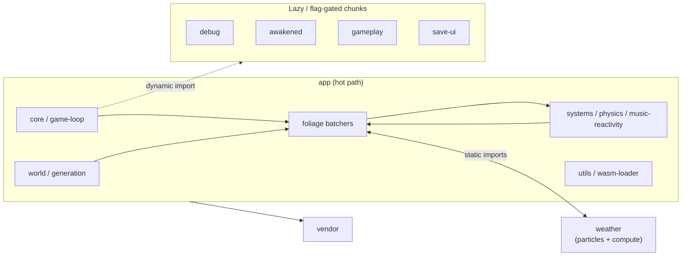

# App Chunk Split (#1361 / #1450 follow-up)

## Problem

Production builds emitted a single `chunks/app-*.js` that bundled core, foliage,
systems, world, and UI into one Rollup chunk to avoid circular *chunk* graphs.
First paint downloaded the full game brain even when optional features (presence,
photo mode, generative audio, debug overlays) were off.

Vite warns when any chunk exceeds 500 KB raw. The `app` chunk remains above that
soft limit because the foliage batcher + music-reactivity + physics hot path must
stay co-located.

## Targets

| Metric | Hard ceiling | Stretch | Notes |
|--------|--------------|---------|-------|
| `app` raw (`build:ci`) | **800 KB** | 500 KB | Enforced by `pnpm run budget:check` (`tools/build-optimizer/budgets.json`) |
| Vite warning | 500 KB | — | Informational; hot path likely stays > 500 KB until fauna/map peel |
| Critical-path flags off | generative / debug / save / gameplay not in `app` | — | Verified via separate async chunks below |

## Baseline (pre-split, ~808 KB `app`)

| Chunk | Raw | Gzip |
|-------|-----|------|
| `app` | 807.87 KB | 239.52 KB |
| `vendor` | 1068.90 KB | 281.96 KB |

## After this PR (`build:ci`)

| Chunk | Raw (approx.) | Gzip | Critical path when |
|-------|---------------|------|-------------------|
| `app` | **~755 KB** | ~237 KB | Always (hot path + audio + boot UI) |
| `weather` | ~105 KB | ~29 KB | Boot (weather orchestrator + particles + compute) |
| `save-ui` | ~63 KB | ~16 KB | `openSaveMenu` / save hooks |
| `debug` | ~30 KB | ~10 KB | `?debug=*` URL flags |
| `awakened` | ~9 KB | ~3 KB | `?awakened` |
| `shader-warmup` | ~6 KB | ~2 KB | Loading-screen warmup phase |
| `gameplay` | ~16 KB | ~5 KB | After `__sceneReady` / first ability |

| `world-content` | ~13 KB | ~5 KB | Procedural extras pass |
| `analytics-debug` | ~21 KB | ~5 KB | `?debug=1` / `/stats` |
| `generative-music` | (async) | — | `?generative=1` / `enableGenerativeMode()` |

**Co-located in `app` (not separate chunks):** `audio`, `presence`, `photo-mode`,
`playlist-ui`, `interaction`, `hud-ui`, `camera-modes` — each created a Rollup
`Circular chunk: … ↔ app` graph when split. Lazy `*-lazy.ts` stubs still gate
runtime loading; only the Rollup chunk boundary was removed.

**`weather` chunk (particles + compute + orchestrator):** must stay separate from
`app` — folding weather into `app` causes TDZ init failures; splitting particles
out of `weather` deadlocks boot. A benign `Circular chunk: weather ↔ app` warning
remains (static foliage ↔ particles imports). `systems/weather.ts` re-exports only
`WeatherState` + `type WeatherSystem` to avoid extra app→weather value edges.

**Do not** split foliage batchers that import `music-reactivity` / `foliage/index`
barrel into async chunks without breaking TSL live bindings (see deferred-visuals
attempt below).

## Cycle map (madge, `src/core/main.ts` entry)

Rollup **chunk** cycles are avoided by keeping the hot path in `app`. TypeScript
**module** cycles still exist inside `app` (81+ reported by madge) — expected for
foliage ↔ systems:



Representative madge cycle (module-level, stays inside `app`):

```
foliage/index → animation → batcher → ecs/world → wasm-loader → loading-screen
  → awakened-persistence → luminous-plant-batcher → … → foliage/index
```

## Contributor table (must stay in `app`)

| Area | Why co-located |
|------|----------------|
| `src/foliage/*` batchers + `foliage/index` barrel | TSL uniform live bindings; splitting batchers reintroduces chunk cycles |
| `src/systems/music-reactivity*.ts` | Shared uniforms with batchers; wave leaf is `music-wave.ts` |
| `src/systems/physics/*` | Per-frame player + discovery hot path |
| `src/world/generation-core.ts` | Boot world population |
| `src/utils/wasm-loader*` | Ground height + boot pipeline |
| `src/core/game-loop*.ts` | Frame coordinator |
| `src/rendering/gpu-context.ts` | WebGPU device (boot) |
| `src/audio/*` (except generative async peel) | Boot audio + beat sync; `audio ↔ app` cycle when split |
| `src/core/hud.ts`, `camera-modes.ts`, `input/playlist-manager.ts` | Boot UI wiring; chunk cycles with core |
| `src/systems/interaction.ts`, `net/*`, `photo-mode/*` | Static core imports; lazy stubs remain for runtime gating |

| Area | Separate `weather` chunk |
|------|--------------------------|
| `src/systems/weather/*`, `src/particles/*`, `src/compute/*` | Foliage statically imports particles; weather imports foliage — must not fold into `app` |

## Safe extractions (implemented)

| Chunk | Trigger | Entry stub |
|-------|---------|------------|
| `debug` | `?debugHeights` / `?debugPlace` / `?debugCircadian` / `?debugFauna` / `?debug=1` | `src/debug/tools-stub.ts`, `src/debug/lazy.ts` |
| `presence` | `FEATURE_FLAGS.presence` | `src/systems/net/lazy.ts`, `src/ui/presence-lazy.ts` (chunk co-located in `app`) |
| `photo-mode` | `FEATURE_FLAGS.photoMode` or **P** | `src/systems/photo-mode/lazy.ts` (chunk co-located in `app`) |
| `generative-music` | `enableGenerativeMode()` / `?generative=1` | dynamic import in `audio-system-playback.ts` |
| `awakened` | `FEATURE_FLAGS.awakenedPersistence` | `src/systems/awakened-persistence-api.ts` |
| `gameplay` | `preloadGameplay()` / abilities | `src/gameplay/lazy.ts` |
| `save-ui` | `openSaveMenu` | `src/ui/save-menu/lazy.ts`, `save-integration-lazy.ts` |
| `shader-warmup` | Loading warmup phase | dynamic import in `deferred-init.ts`, `shader-warmup.ts` |
| `accessibility-ui` | First accessibility menu open | `accessibility-menu-lazy.ts` |

## Power-tier loading

`getLoadMemoryTier()` / `getLoadMemoryScale()` in `src/core/config/runtime.ts` scale
spawn counts and batcher caps. `shouldPreferLightWorldLoad()` also returns true for
`?lite=1` (and existing `?webglLite=1` via `isWebGLLiteMode()`).

Integrated / low-`maxStorageBufferBindingSize` devices: prefer CORE world + reduced
caps (existing CI population scaling + lite URL flags).

## Budget

`pnpm run budget:check` enforces `budgets.json` → `app: 800kb` (raw `app-*.js`).
Fails the build when the `app` chunk exceeds the ceiling.

## Non-goals

- Not splitting `vendor` / Three.js.
- No visual redesign.
- No deletion of WASM fallbacks.
- Foliage batchers with live music bindings stay in `app` until a cycle-safe peel lands.

## Follow-ups

- Break `weather ↔ app` static import cycle (particles lazy peel from foliage) so the last Rollup circular-chunk warning clears without TDZ regressions.
- Fauna / map-loader peel for stretch 500 KB `app` target.
- Config hygiene (#config split) in parallel.

## Refs

- `vite.config.js` `manualChunks`
- Prior: #1361, #1450
- `FEATURE_FLAGS` in `src/core/config/url-flags.ts`
