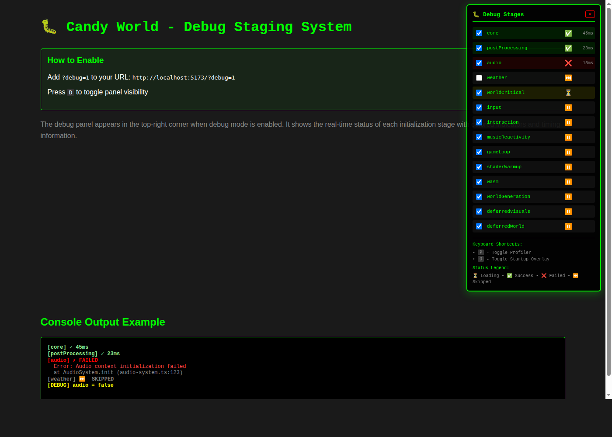

# Debug Staging System - Quick Reference

## What is it?

A debug tool that lets you selectively enable/disable initialization stages to isolate failures in the Candy World project.

## Quick Start

1. Add `?debug=1` to your URL: `http://localhost:5173/?debug=1`
2. Press **D** to show/hide the debug panel
3. Use checkboxes to enable/disable stages
4. Watch console for colored logs

## Debug Panel Preview



The panel shows:
- ✅ **Green** - Stage loaded successfully
- ❌ **Red** - Stage failed (hover for error)
- ⏳ **Yellow** - Stage currently loading
- ⏭️ **Gray** - Stage skipped
- ⏸️ **Pause** - Stage pending

## 14 Configurable Stages

| # | Stage | Description | Required |
|---|-------|-------------|----------|
| 1 | core | Scene, renderer, camera, lights | ✓ |
| 2 | postProcessing | Post-processing effects | |
| 3 | audio | Audio system and beat sync | |
| 4 | weather | Weather system | |
| 5 | worldCritical | Base world (sky, ground, moon) | |
| 6 | input | Input handling and controls | |
| 7 | interaction | Interaction system | |
| 8 | musicReactivity | Music-driven visual effects | |
| 9 | gameLoop | Game loop initialization | |
| 10 | shaderWarmup | Shader compilation | |
| 11 | wasm | Emscripten C++ module | |
| 12 | worldGeneration | Full world generation | |
| 13 | deferredVisuals | Celestial bodies, aurora | |
| 14 | deferredWorld | Additional world content | |

## Console Output Example

```
[core] ✓ 45ms                  // Success (green)
[postProcessing] ✓ 23ms        // Success (green)
[audio] ✗ FAILED               // Failed (red)
  Error: Audio context initialization failed
  at AudioSystem.init (audio-system.ts:123)
[weather] ⏭️ SKIPPED           // Skipped (gray)
[DEBUG] audio = false          // Toggle event (yellow)
```

## Common Use Cases

### 1. Test Core Scene Only
Disable all stages except `core` to verify basic Three.js setup works.

### 2. Isolate Audio Failure
Disable `audio` and `musicReactivity` to bypass audio issues.

### 3. Skip Heavy World Generation
Disable `worldGeneration` and `deferredWorld` for faster testing.

### 4. Debug Shader Issues
Enable only `core`, `postProcessing`, and `shaderWarmup`.

## Keyboard Shortcuts

- **D** - Toggle debug panel
- **P** - Toggle profiler
- **O** - Toggle startup overlay

## Files

- **Code**: `src/debug/stages.ts`, `src/debug/panel.ts`
- **Integration**: `src/core/main.ts`
- **Docs**: `docs/DEBUG_STAGING_SYSTEM.md` (full documentation)

## Implementation

Wraps initialization code with `StageLoader`:

```typescript
await StageLoader.loadStage('stageName', async () => {
  // Your initialization code
  const result = await someInit();
  return result;
});
```

## Notes

- **No Production Impact**: Only active with `?debug=1`
- **Performance Overhead**: ~5-10ms per stage
- **Error Handling**: Non-fatal by default (except core stage)
- **Timing Data**: Shows milliseconds for each stage

## Related

- Issue: #814 (Debug checkpoints)
- Full Documentation: [DEBUG_STAGING_SYSTEM.md](DEBUG_STAGING_SYSTEM.md)
- Implementation: [DEBUG_STAGING_IMPLEMENTATION_SUMMARY.md](DEBUG_STAGING_IMPLEMENTATION_SUMMARY.md)
